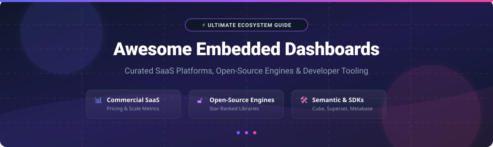

# Awesome Embedded Dashboards & Analytics 📊

<p align="center">
  
</p>

<p align="center">
  <a href="https://github.com/ishandutta2007/Awesome-Awesome-Awesome"></a><a href="https://discord.gg/jc4xtF58Ve"></a>
  <a href="https://github.com/ishandutta2007/Awesome-Embedded-Dashboards"></a>
  <a href="https://github.com/ishandutta2007/Awesome-Embedded-Dashboards/blob/main/LICENSE"></a>
  <a href="https://github.com/ishandutta2007"></a>
</p>

# 📊 Top Embedded Analytics Platforms & Open-Source Dashboard Ecosystem

> **Curated Directory of SaaS Products, Open-Source GitHub Projects, Semantic Layers & Developer SDKs for Embedded Analytics, Customer-Facing BI, White-Label Dashboards, and Multi-Tenant Data Apps.**

*Last updated: September 2026* 🗓️

---

## 📌 Overview

This repository tracks notable **SaaS/Hosted platforms** and **open-source GitHub projects** for **embedded analytics and embedded dashboards**.

Embedded analytics allows software companies to place **dashboards, reports, charts, self-service analytics and data exploration directly inside their own applications**, allowing customers to consume analytics without leaving the product. 🚀

Typical capabilities include **white-labeling, multi-tenancy, row-level security (RLS), embedded dashboards, interactive charts, self-service exploration, dashboard builders, semantic layers, APIs/SDKs, SSO, customer-specific data access, analytics portals and developer-controlled customization**. 🔑

---

## 💡 Architecture & Open-Source Stack Concept

An open-source embedded analytics stack does **not necessarily need to be a single monolithic product**:

```text
                    YOUR SaaS APPLICATION
                             │
              ┌──────────────┴──────────────┐
              │                             │
              ▼                             ▼
         Application UI                Analytics UI
              │                             │
              └──────────────┬──────────────┘
                             ▼
                   Embedded Analytics Layer
                             │
               ┌─────────────┼─────────────┐
               ▼             ▼             ▼
           Dashboards    Semantic Layer   APIs/SDK
               │             │             │
               └─────────────┼─────────────┘
                             ▼
                        Data Warehouse
                             │
               PostgreSQL / ClickHouse / DuckDB
```

For example, **Apache Superset** provides an Embedded SDK for placing Superset dashboards inside another application, while **Metabase** provides modular embedding and React/web-component approaches. **Lightdash** provides an open-source BI platform with embedding capabilities, and **Cube Core** provides an open-source semantic layer specifically designed to power embedded analytics. ⚡

---

## 📖 Table of Contents

- [☁️ SaaS/Hosted Platforms](#%EF%B8%8F-saashosted-platforms)
- [🔓 Open-Source GitHub Projects](#-open-source-github-projects)
  - [⚡ Complete Open-Source BI & Embedded Analytics Platforms](#-complete-open-source-bi--embedded-analytics-platforms)
  - [🧠 Open-Source Semantic Layers](#-open-source-semantic-layers)
  - [🎨 Dashboard & Visualization Frameworks](#-dashboard--visualization-frameworks)
  - [📦 Embedded Analytics SDKs & Components](#-embedded-analytics-sdks--components)
  - [🗄️ Analytical Databases & Storage Infrastructure](#%EF%B8%8F-analytical-databases--storage-infrastructure)
  - [🔄 Data Engineering, Orchestration & Pipelines](#-data-engineering-orchestration--pipelines)
  - [🔐 Security, Automation & Supporting Infrastructure](#-security-automation--supporting-infrastructure)
- [🔄 Commercial → Open-Source Capability Mapping](#-commercial--open-source-capability-mapping)
- [🏗️ Framework for Building a Self-Hosted Embedded Analytics Platform](#%EF%B8%8F-framework-for-building-a-self-hosted-embedded-analytics-platform)
- [📈 Star History](#-star-history)
- [❤️ Support & Community](#%EF%B8%8F-support--community)
- [🤝 How to Contribute](#-how-to-contribute)
- [⚠️ Disclaimer](#%EF%B8%8F-disclaimer)

---

## ☁️ SaaS/Hosted Platforms

### 🌐 Market Size & Industry Dynamics
> **Estimated Sector Market Size:** The global Embedded Analytics market size is estimated at **\$68.5 Billion in 2026** (growing at ~15.4% CAGR from \$34 Billion in 2021).  
> **Market Fragmentation:** The sector is **moderately fragmented**, featuring legacy BI giants (Microsoft Power BI, Salesforce Tableau, Google Looker) alongside fast-growing developer-first startups (Explo, Luzmo, Cube, Embeddable). It is **not a winner-take-all market** due to differing developer customization requirements, data security constraints, and self-hosted vs multi-tenant cloud needs.

### 📊 SaaS Products Matrix (Sorted by Scale / Valuation / Revenue Descending)

| Product | Enterprise Scale / Valuation / Revenue | Specific Starting Pricing | Free Tier / Trial Limit | Description & Key Capabilities |
| :--- | :--- | :--- | :--- | :--- |
| **[Power BI Embedded](https://azure.microsoft.com/products/power-bi-embedded/)** | **\$3.1 Trillion** *(Microsoft Parent Cap)* | \$1.008/hour (~\$735/month for A1 node) | \$200 Azure free credit (30 days limit) | Azure service for embedding Power BI reports, dashboards, and interactive analytics directly into SaaS applications. |
| **[Looker](https://cloud.google.com/looker)** | **\$2.1 Trillion** *(Alphabet Parent Cap)* | \$5,000/month (Standard Platform tier) | 30-day Google Cloud free trial (\$300 credits) | Google Cloud's governed BI & embedded platform featuring LookML semantic modeling and developer embedding APIs. |
| **[Tableau Embedded](https://www.tableau.com/developer/tools/embedding)** | **\$250 Billion** *(Salesforce Parent Cap)* | \$15/user/month (Embedded Viewer tier) | 14-day full feature free trial | Salesforce Tableau embedding toolkit for integrating rich visual analytics, dashboards, and self-service portals. |
| **[Qlik Embedded Analytics](https://www.qlik.com/us/products/embedded-analytics)** | **\$10 Billion** *(Thoma Bravo / Enterprise)* | \$840/month (Standard SaaS tier) | 30-day free trial | Governed associative engine & analytics platform for embedding interactive visualizations and multi-tenant portals. |
| **[Sisense](https://www.sisense.com/)** | **\$1.1 Billion** *(Valuation)* | \$10,000/year (~\$833/month entry) | 30-day free trial (Full API & Fusion access) | Enterprise API-first embedded analytics platform featuring AI-assisted exploration and customized SDK components. |
| **[ThoughtSpot Embedded](https://www.thoughtspot.com/product/embedded-analytics)** | **\$4.5 Billion** *(Valuation)* | \$1,250/month (Developer tier) | 30-day free trial (Includes 2,500 query credits) | Search-driven and Natural Language AI embedded analytics platform for customer-facing SaaS applications. |
| **[Domo Embedded](https://www.domo.com/product/embedded-analytics)** | **\$300 Million** *(Market Cap)* | \$300/month (Freemium pay-as-you-go) | Free Tier forever (5 users limit, 300 data credits/mo) | Cloud-native data platform providing embedded analytics, interactive dashboards, and white-label data apps. |
| **[Sigma Computing](https://www.sigmacomputing.com/)** | **\$1.5 Billion** *(Valuation)* | \$500/month (Pro Starting tier) | 14-day free trial | Cloud-native spreadsheet-interface analytics with embedded iframe/SDK capabilities for customer portals. |
| **[GoodData](https://www.gooddata.ai/)** | **\$100 Million+** *(PE Backed)* | \$1,000/month (Growth Tier) | 30-day free trial (GoodData Cloud Professional) | Governed multi-tenant embedded analytics engine with headless semantic layer and white-label dashboards. |
| **[Logi Analytics](https://www.logianalytics.com/)** | **\$500 Million** *(Acquired by insightsoftware)* | \$1,200/month | 14-day developer free trial | Developer-focused embedded BI software for embedding reports, dashboards, and self-service authoring inside apps. |
| **[Yellowfin](https://www.yellowfinbi.com/)** | **\$100 Million+** *(Acquired by Idera)* | \$10,000/year (~\$833/month) | 30-day free trial | Actionable embedded BI & data storytelling platform with white-labeling, automated signals, and governance. |
| **[Preset](https://preset.io/)** | **\$100 Million** *(Valuation)* | \$20/user/month (Professional tier) | Free Tier forever (Up to 5 team members limit) | Fully managed cloud platform for Apache Superset with embedded dashboard SDK, guest token auth, and row-level security. |
| **[Metabase](https://www.metabase.com/)** | **\$100 Million** *(Valuation)* | \$85/month (Pro tier with interactive embedding) | 14-day free trial (Metabase Cloud Pro) | Open-core BI platform featuring view-only embedding, interactive embedding SDKs, and multi-tenant row-level permissions. |
| **[Explo](https://www.explo.co/)** | **\$50 Million** *(Valuation)* | \$650/month (Growth tier) | 14-day free trial | Developer-first embedded analytics platform for building customer-facing dashboards, customer portals, and report builders. |
| **[Toucan Toco](https://www.toucantoco.com/)** | **\$30 Million** *(Funding)* | \$990/month | 14-day free trial | White-label customer-facing analytics platform focused on guided data storytelling, web components, and multi-tenancy. |
| **[Holistics](https://www.holistics.io/)** | **\$20 Million** *(Bootstrapped/Scale)* | \$400/month (Standard tier) | 14-day free trial (Full feature access) | Business intelligence and embedded dashboard portal platform with code-based semantic layer (AMQL) and signed URLs. |
| **[Bold BI](https://www.boldbi.com/)** | **\$20 Million** *(Syncfusion Division)* | \$495/month (Embedded Growth tier) | 15-day free trial | Embedded dashboard software by Syncfusion supporting JavaScript SDKs, multi-tenant isolation, and white-labeling. |
| **[Luzmo](https://www.luzmo.com/)** | **\$15 Million** *(Funding)* | \$995/month (Growth tier) | 10-day free trial (Includes full SDK access) | Embedded analytics platform tailored for SaaS products with flexible API/SDK integration and low-code dashboard builder. |
| **[Embeddable](https://embeddable.com/)** | **\$10 Million** *(Early Stage)* | \$750/month (Starter tier) | 14-day developer free trial | Headless developer platform combining semantic layer, custom React components, and low-latency database connectivity. |
| **[Reveal Embedded Analytics](https://www.revealbi.io/)** | **\$10 Million** *(Infragistics Division)* | \$9,950/year flat rate (~\$829/month) | 30-day free trial | Native embedded SDK for Web, iOS, Android, Desktop to embed interactive dashboards with client-side renderers. |

---

## 🔓 Open-Source GitHub Projects

> **Open-Source Ecosystem Note:** This section contains open-source BI engines, semantic layers, SDKs, visualization libraries, and analytical databases that can be self-hosted and combined into a custom embedded analytics architecture.

### ⚡ Complete Open-Source BI & Embedded Analytics Platforms
*Projects sorted by GitHub Stars_Count (Descending)*

* [](https://github.com/apache/superset/stargazers) **[Apache Superset](https://github.com/apache/superset)** — Open-source modern enterprise BI and data exploration platform with an official Embedded SDK, SQL Lab, and rich charting controls. 📊
* [](https://github.com/grafana/grafana/stargazers) **[Grafana](https://github.com/grafana/grafana)** — Operational dashboarding and visualization framework supporting multi-tenant plugins, alerts, and iframe/API embedding. 📈
* [](https://github.com/metabase/metabase/stargazers) **[Metabase](https://github.com/metabase/metabase)** — User-friendly open-source BI platform offering modular embedding, interactive question builders, and React web components. 🔍
* [](https://github.com/streamlit/streamlit/stargazers) **[Streamlit](https://github.com/streamlit/streamlit)** — Python framework for turning data scripts into shareable, interactive web applications and embedded analytical portals. 🐍
* [](https://github.com/plotly/dash/stargazers) **[Dash](https://github.com/plotly/dash)** — Python and R framework built on top of Plotly.js and React for constructing analytical web applications. ⚡
* [](https://github.com/getredash/redash/stargazers) **[Redash](https://github.com/getredash/redash)** — Open-source query tool and dashboard builder designed to connect to any data source and share visualizations. 🎯
* [](https://github.com/evidence-dev/evidence/stargazers) **[Evidence](https://github.com/evidence-dev/evidence)** — Code-based BI framework that turns markdown and SQL queries into interactive, version-controlled web dashboards. 📝
* [](https://github.com/lightdash/lightdash/stargazers) **[Lightdash](https://github.com/lightdash/lightdash)** — dbt-native open-source BI platform designed for developer-led metrics, embedded dashboards, and row-level security. 💡
* [](https://github.com/appsmithorg/appsmith/stargazers) **[Appsmith](https://github.com/appsmithorg/appsmith)** — Open-source low-code platform for building custom internal tools, admin panels, and embedded analytics applications. 🛠️
* [](https://github.com/ToolJet/ToolJet/stargazers) **[ToolJet](https://github.com/ToolJet/ToolJet)** — Extensible open-source low-code framework to build data tools and customer analytics portals. 🚀
* [](https://github.com/rilldata/rill/stargazers) **[Rill Developer](https://github.com/rilldata/rill)** — Fast, code-based analytics application engine powered by DuckDB for fast dashboard generation. ⏱️
* [](https://github.com/rstudio/shiny/stargazers) **[Shiny](https://github.com/rstudio/shiny)** — Web application framework for R and Python to construct interactive analytical interfaces. 🔬
* [](https://github.com/finos/perspective/stargazers) **[Perspective](https://github.com/finos/perspective)** — Fast streaming data visualization component for real-time and high-concurrency embedded analytics. ⚡

---

### 🧠 Open-Source Semantic Layers
*Projects sorted by GitHub Stars_Count (Descending)*

* [](https://github.com/cube-js/cube/stargazers) **[Cube Core](https://github.com/cube-js/cube)** — Universal semantic layer for AI, BI, and embedded analytics; exposes APIs (REST, GraphQL, SQL) with multitenancy RLS. 🧊
* [](https://github.com/malloydata/malloy/stargazers) **[Malloy](https://github.com/malloydata/malloy)** — Experimental analytical language and semantic modeling framework designed for nested data exploration. 🔮
* [](https://github.com/dbt-labs/metricflow/stargazers) **[MetricFlow](https://github.com/dbt-labs/metricflow)** — Metric abstraction engine powers dbt semantic layer for defining business metrics consistently. 📐

---

### 🎨 Dashboard & Visualization Frameworks
*Projects sorted by GitHub Stars_Count (Descending)*

* [](https://github.com/d3/d3/stargazers) **[D3.js](https://github.com/d3/d3)** — Fundamental JavaScript library for manipulating documents based on data to create fully bespoke visualization systems. 🎨
* [](https://github.com/apache/echarts/stargazers) **[Apache ECharts](https://github.com/apache/echarts)** — Powerful interactive charting and data visualization library for browser and mobile apps. 📊
* [](https://github.com/chartjs/Chart.js/stargazers) **[Chart.js](https://github.com/chartjs/Chart.js)** — Simple yet flexible JavaScript charting library for designers & developers. 📉
* [](https://github.com/plotly/plotly.js/stargazers) **[Plotly.js](https://github.com/plotly/plotly.js)** — High-level declarative charting library powering scientific and statistical dashboards. 🧪
* [](https://github.com/recharts/recharts/stargazers) **[Recharts](https://github.com/recharts/recharts)** — Redefined chart library built with React and D3 components. ⚛️
* [](https://github.com/vega/vega-lite/stargazers) **[Vega-Lite](https://github.com/vega/vega-lite)** — High-level grammar of interactive graphics built on Vega. 📜
* [](https://github.com/plouc/nivo/stargazers) **[Nivo](https://github.com/plouc/nivo)** — Rich set of React components to build dataviz apps with server-side rendering support. 🖼️
* [](https://github.com/tremorlabs/tremor/stargazers) **[Tremor](https://github.com/tremorlabs/tremor)** — React component library to build modern dashboard interfaces fast. 🧱
* [](https://github.com/vega/vega/stargazers) **[Vega](https://github.com/vega/vega)** — Visualization grammar defining visual appearance and interactive behavior in JSON format. 🔤
* [](https://github.com/observablehq/plot/stargazers) **[Observable Plot](https://github.com/observablehq/plot)** — Concise JavaScript library for exploratory data visualization. ✍️

---

### 📦 Embedded Analytics SDKs & Components
*Projects sorted by GitHub Stars_Count (Descending)*

* [](https://github.com/marmelab/react-admin/stargazers) **[React Admin](https://github.com/marmelab/react-admin)** — B2B application framework for building data-driven dashboards and client portals on REST/GraphQL APIs. 💻
* [](https://github.com/apache/arrow/stargazers) **[Apache Arrow](https://github.com/apache/arrow)** — In-memory columnar data format designed for high-performance analytical data movement. 🏹
* [](https://github.com/apache/datafusion/stargazers) **[Apache Arrow DataFusion](https://github.com/apache/datafusion)** — Extensible Rust-native SQL query engine for building custom analytical databases and embedded runtimes. 🦀
* [](https://github.com/apache/superset/tree/master/superset-embedded-sdk) **[Superset Embedded SDK](https://github.com/apache/superset/tree/master/superset-embedded-sdk)** — Dedicated JavaScript SDK for embedding Superset dashboards securely with guest tokens. 🔐

---

### 🗄️ Analytical Databases & Storage Infrastructure
*Projects sorted by GitHub Stars_Count (Descending)*

* [](https://github.com/postgres/postgres/stargazers) **[PostgreSQL](https://github.com/postgres/postgres)** — World's most advanced relational database with powerful Row-Level Security (RLS) for tenant isolation. 🐘
* [](https://github.com/ClickHouse/ClickHouse/stargazers) **[ClickHouse](https://github.com/ClickHouse/ClickHouse)** — Fast open-source column-oriented DBMS for real-time high-concurrency multi-tenant analytics. ⚡
* [](https://github.com/duckdb/duckdb/stargazers) **[DuckDB](https://github.com/duckdb/duckdb)** — In-process SQL OLAP database engine designed for ultra-fast local/embedded analytical execution. 🦆
* [](https://github.com/apache/spark/stargazers) **[Apache Spark](https://github.com/apache/spark)** — Unified analytics engine for large-scale data processing and ETL pipelines. ❇️
* [](https://github.com/trinodb/trino/stargazers) **[Trino](https://github.com/trinodb/trino)** — Fast distributed SQL query engine for federated queries across multiple data sources. 🦩
* [](https://github.com/minio/minio/stargazers) **[MinIO](https://github.com/minio/minio)** — High-performance S3-compatible object storage server for cloud-native analytical data lakes. 🪣
* [](https://github.com/apache/druid/stargazers) **[Apache Druid](https://github.com/apache/druid)** — Real-time analytics database designed for fast sub-second slice-and-dice queries. ⏱️
* [](https://github.com/apache/pinot/stargazers) **[Apache Pinot](https://github.com/apache/pinot)** — Distributed real-time OLAP datastore designed for low-latency user-facing analytics. 🍷

---

### 🔄 Data Engineering, Orchestration & Pipelines
*Projects sorted by GitHub Stars_Count (Descending)*

* [](https://github.com/apache/airflow/stargazers) **[Apache Airflow](https://github.com/apache/airflow)** — Programmatic workflow orchestration platform to author, schedule, and monitor data pipelines. 🌀
* [](https://github.com/airbytehq/airbyte/stargazers) **[Airbyte](https://github.com/airbytehq/airbyte)** — Open-source data integration platform to sync data from applications to data warehouses. 🐙
* [](https://github.com/dbt-labs/dbt-core/stargazers) **[dbt-core](https://github.com/dbt-labs/dbt-core)** — Analytics engineering framework to transform raw warehouse data using SQL & software practices. 🟧
* [](https://github.com/dagster-io/dagster/stargazers) **[Dagster](https://github.com/dagster-io/dagster)** — Cloud-native data orchestrator for machine learning, analytics, and data engine pipelines. 🟨
* [](https://github.com/meltano/meltano/stargazers) **[Meltano](https://github.com/meltano/meltano)** — CLI-first declarative ELT tooling for data engineering operations. 🦡

---

### 🔐 Security, Automation & Supporting Infrastructure
*Projects sorted by GitHub Stars_Count (Descending)*

* [](https://github.com/n8n-io/n8n/stargazers) **[n8n](https://github.com/n8n-io/n8n)** — Fair-code workflow automation platform for triggering analytics alerts and customer actions. ⚡
* [](https://github.com/keycloak/keycloak/stargazers) **[Keycloak](https://github.com/keycloak/keycloak)** — Open-source identity and access management system providing SSO, OAuth2, and OIDC for embedded portals. 🔑
* [](https://github.com/open-metadata/OpenMetadata/stargazers) **[OpenMetadata](https://github.com/open-metadata/OpenMetadata)** — Open-source metadata platform for data governance, discovery, and schema lineage. 📖
* [](https://github.com/OpenLineage/OpenLineage/stargazers) **[OpenLineage](https://github.com/OpenLineage/OpenLineage)** — Open standard for data lineage collection and tracking across processing jobs. 🌐

---

## 🔄 Commercial → Open-Source Capability Mapping

| Commercial Platform | Primary Commercial Focus | Open-Source Equivalents / Building Blocks |
| :--- | :--- | :--- |
| **Explo** | Developer-first embedded dashboards | Apache Superset + Embedded SDK + Cube + ECharts |
| **Toucan Toco** | White-label embedded analytics + storytelling | Lightdash + Cube + ECharts + Custom React |
| **GoodData** | Enterprise embedded analytics + semantic layer | Lightdash + Cube + Superset + PostgreSQL |
| **Sisense** | Enterprise embedded analytics + AI | Lightdash + Cube + Superset + ClickHouse |
| **Looker Embedded** | Governed BI + semantic modeling + embedding | Cube + Lightdash + Superset + dbt-core |
| **Reveal BI** | Embedded dashboards + self-service BI | Superset + Metabase + ECharts |
| **Bold BI** | Embedded dashboards + SDK/API + multi-tenancy | Superset + Cube + ECharts + Keycloak |
| **Logi Analytics** | Embedded BI + developer customization | Superset + Cube + React + ECharts |
| **Metabase Enterprise** | Embedded BI + self-service analytics | Metabase OSS + Cube + PostgreSQL |
| **Holistics** | Embedded dashboards + portals + semantic modeling | Lightdash + Cube + Superset |
| **Luzmo** | SaaS embedded analytics | Lightdash + Cube + ECharts |
| **Embeddable** | Developer-first embedded analytics | Cube + Superset + Custom React |
| **Tableau Embedded** | Rich visual analytics | Superset + ECharts + Vega |
| **Power BI Embedded** | Enterprise BI embedding | Superset + Lightdash + Cube |
| **ThoughtSpot Embedded** | Search/AI-driven analytics | Cube + Lightdash + LLM Layer + ECharts |
| **Qlik Embedded** | Governed associative analytics | Cube + Superset + ClickHouse |
| **Grafana Enterprise** | Operational analytics dashboards | Grafana OSS |
| **Redash Enterprise** | SQL analytics + dashboards | Redash + PostgreSQL |
| **Evidence Cloud** | Code-based analytics | Evidence + dbt-core + DuckDB |

---

## 🏗️ Framework for Building a Self-Hosted Embedded Analytics Platform

| Layer | Recommended Open-Source Stack Component |
| :--- | :--- |
| **Frontend Frame** | React · Next.js · Vue.js |
| **Dashboard UI** | Apache Superset · Metabase · Lightdash |
| **Custom Charts** | Apache ECharts · D3.js · Plotly.js · Tremor |
| **Embedded Analytics SDK** | Superset Embedded SDK · Metabase Web Components · Lightdash SDK |
| **Semantic Layer** | Cube Core · Lightdash Semantic Layer · MetricFlow |
| **Data Modeling** | dbt-core · SQL |
| **Query Engine** | Trino · DataFusion · DuckDB |
| **Analytics Database** | ClickHouse · Apache Druid · Apache Pinot |
| **Application Database** | PostgreSQL |
| **Data Ingestion** | Airbyte · Meltano |
| **Orchestration** | Apache Airflow · Dagster |
| **Object Storage** | MinIO |
| **Authentication & AuthZ** | Keycloak · JWT · OAuth2 |
| **Multi-Tenancy RLS** | PostgreSQL RLS · Cube Security Context |

---

## 📈 Star History

[](https://star-history.dera.page/#ishandutta2007/Awesome-Embedded-Dashboards&type=date&legend=top-left)

---

## ❤️ Support & Community

Thank you for visiting **Awesome Embedded Dashboards**! 🌟

If you find this curated directory helpful for evaluating embedded BI products or constructing self-hosted customer analytics platforms, please consider supporting the project:
* ⭐ **Star this repository** to help others discover it!
* 🔀 **Fork & Share** with your developer and data engineering networks.
* ☕ **Sponsor & Buy me a coffee:** [](https://github.com/sponsors/ishandutta2007)

---

## 🤝 How to Contribute

1. Fork the repository.
2. Add or edit entries in `README.md` following the existing structured format.
3. Include official website links and active GitHub repository references.
4. Ensure accurate classification: **SaaS/Hosted**, **Open-Source Engine**, **Semantic Layer**, or **Visualization Library**.
5. Submit a Pull Request with a clear summary of additions.

---

## ⚠️ Disclaimer

- This repository is a **curated community catalog**, not an endorsement or official ranking.
- SaaS pricing, limits, and enterprise features change over time; verify directly with vendors.
- Open-source projects vary in production readiness and licensing; audit dependencies before deployment.

---

<p align="center">
  <b>Built with ❤️ for SaaS Founders, Product Managers, Data Engineers & Full-Stack Developers.</b>
</p>
